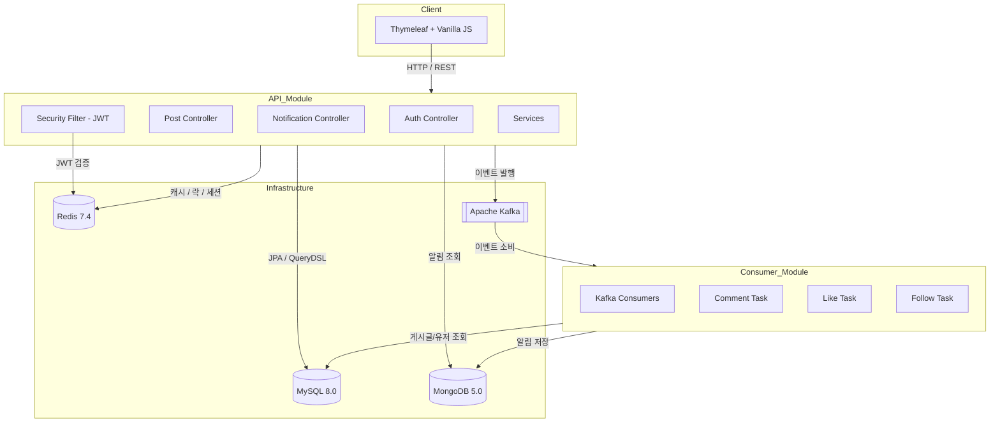
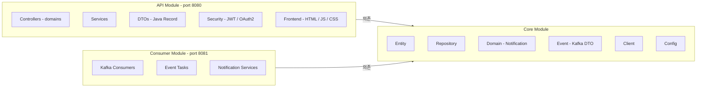
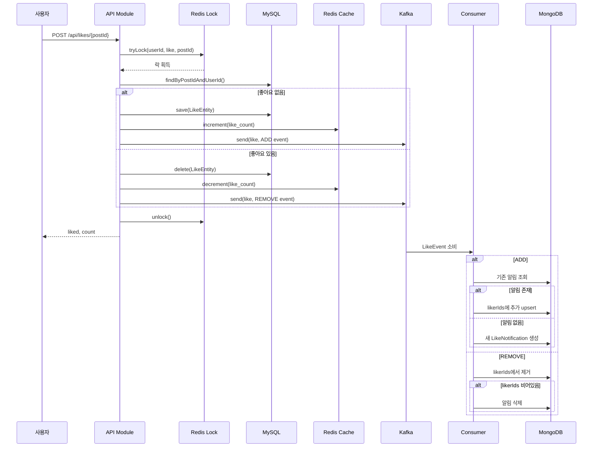
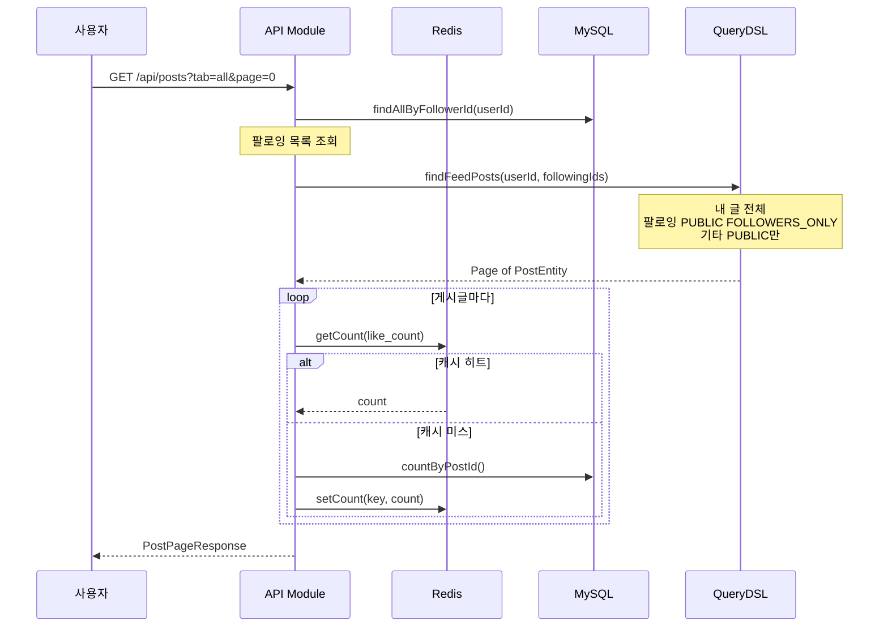
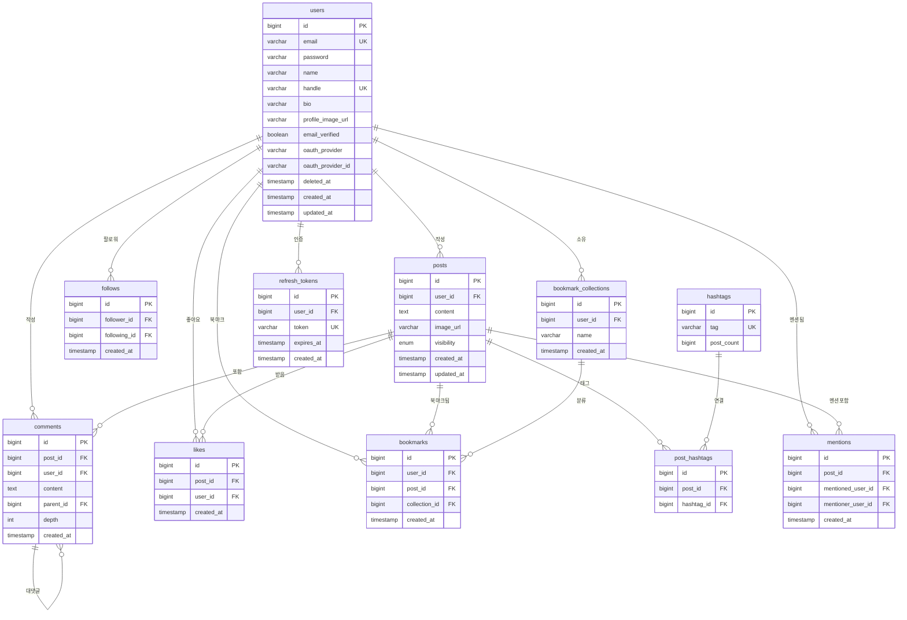
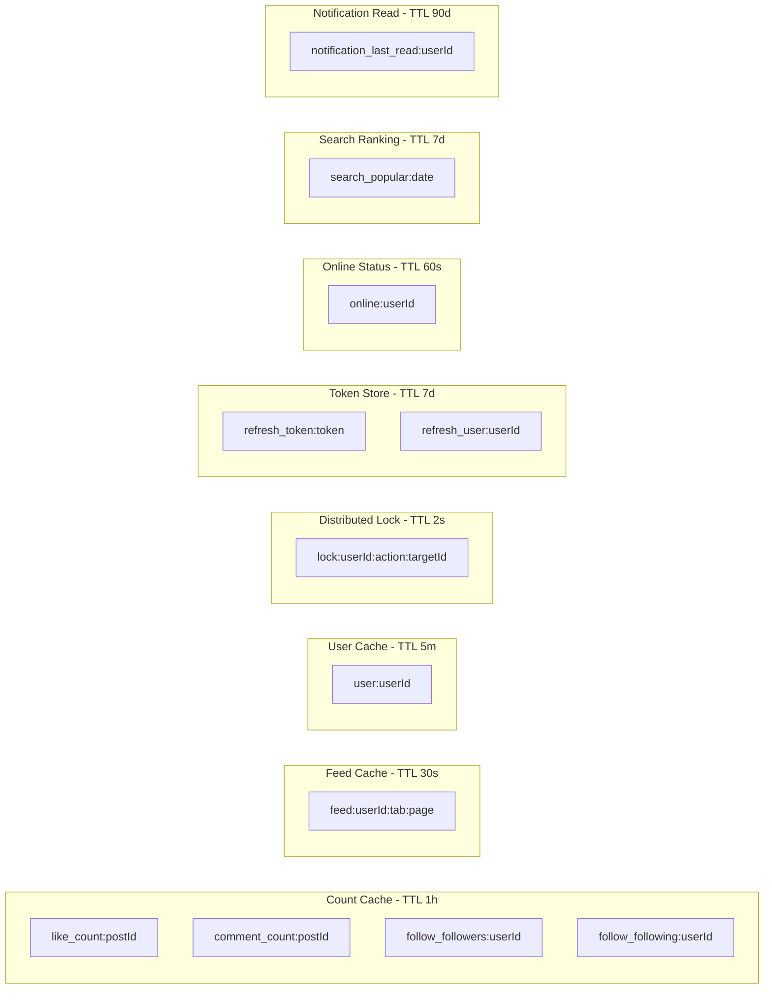

# 🔔 SNS Platform

> **실시간 알림 시스템을 갖춘 소셜 네트워크 서비스**
>
> Spring Boot 3 기반 멀티 모듈 아키텍처 · Kafka 이벤트 · Redis 캐싱 · MongoDB 알림 저장소

<br/>

<p align="center">
  
  
  
  
  
  
  
  
</p>

<br/>

## 📌 프로젝트 소개

SNS는 게시글 작성, 팔로우, 좋아요, 댓글, 북마크, 실시간 알림 등 소셜 네트워크의 핵심 기능을 구현한 프로젝트입니다.

단순한 CRUD를 넘어 **이벤트 기반 아키텍처**, **분산 락**, **다중 데이터소스 전략**, **MSA-Ready 설계**를 적용하여 실무 수준의 백엔드 설계 역량을 보여주는 것을 목표로 하였습니다.

**핵심 목표**

- 🏗️ **MSA 전환을 고려한 모듈 분리** — Entity 간 ID 참조, Client 패턴, 이벤트 기반 통신
- ⚡ **Redis를 활용한 다층 캐싱 전략** — 카운트, 피드, 유저, 세션, 분산 락, 인기 검색어
- 📨 **Kafka 기반 비동기 알림 처리** — API ↔ Consumer 모듈 간 느슨한 결합
- 🔐 **JWT + OAuth2 인증 시스템** — 이중 저장소(MySQL + Redis) 토큰 관리

<br/>

---

## 🏛️ 시스템 아키텍처



<br/>

---

## 📦 모듈 구조



```
sns-platform/
├── api/                          # API 모듈 (port 8080)
│   └── src/main/
│       ├── java/com/a/
│       │   ├── auth/             # 인증 (JWT)
│       │   ├── post/             # 게시글 CRUD, 피드
│       │   ├── comment/          # 댓글, 대댓글
│       │   ├── like/             # 좋아요 토글
│       │   ├── follow/           # 팔로우 토글
│       │   ├── bookmark/         # 북마크, 컬렉션
│       │   ├── search/           # 통합 검색, 트렌딩
│       │   ├── notification/     # 알림 조회 API
│       │   ├── user/             # 프로필, 계정 관리
│       │   ├── hashtag/          # 해시태그, 멘션
│       │   └── common/           # 보안, 예외, 이메일
│       └── resources/
│           ├── templates/        # Thymeleaf
│           └── static/           # JS, CSS
│
├── consumer/                     # Consumer 모듈 (port 8081)
│   └── src/main/java/com/a/
│       ├── consumer/             # Kafka 이벤트 소비자
│       └── task/                 # 알림 생성/삭제 태스크
│
├── core/                         # 공유 모듈
│   └── src/main/java/com/a/
│       ├── entity/               # JPA Entity
│       ├── repository/           # JPA + Redis + Mongo
│       ├── domain/               # MongoDB 도메인
│       ├── event/                # Kafka 이벤트 DTO
│       ├── client/               # 모듈 간 호출 Client
│       ├── config/               # Redis, Mongo, JPA, QueryDSL
│       └── service/              # 알림 저장/조회/삭제
│
└── docker-compose.yml            # MySQL, MongoDB, Redis, Kafka
```

<br/>

---

## ⚡ 주요 기능

### 인증 & 계정

| 기능 | 설명 |
|------|------|
| JWT 인증 | Access Token(15분) + Refresh Token(7일) 이중 토큰 |
| 토큰 이중 저장 | Redis(빠른 조회) + MySQL(영속성) 이중 기록 |
| 이메일 인증 | 회원가입 시 인증 메일 발송, 토큰 기반 검증 |
| 비밀번호 재설정 | 이메일 기반 비밀번호 초기화 플로우 |
| 계정 삭제 | Soft Delete + 연관 데이터 캐스케이딩 정리 |

### 게시글 & 피드

| 기능 | 설명 |
|------|------|
| 피드 탭 | 전체 / 팔로잉 / 인기 3가지 피드 |
| 게시글 공개 범위 | PUBLIC / FOLLOWERS_ONLY / PRIVATE |
| 이미지 업로드 | Multipart 파일 업로드, UUID 기반 파일명 |
| 해시태그 | `#태그` 자동 추출, 해시태그별 검색, 트렌딩 |
| 멘션 | `@핸들` 자동 추출, 사용자 연결 |
| 인기 게시글 | 좋아요 수 기반 QueryDSL LEFT JOIN 정렬 |

### 소셜 기능

| 기능 | 설명 |
|------|------|
| 좋아요 토글 | 분산 락 → DB 토글 → Redis 카운트 → Kafka 이벤트 |
| 팔로우 토글 | 동일 패턴. 자기 자신 팔로우 차단 |
| 댓글 / 대댓글 | 2단계 깊이 제한, 부모 댓글 삭제 시 대댓글 연쇄 삭제 |
| 북마크 컬렉션 | 북마크 토글 + 사용자 정의 컬렉션 관리 |
| 온라인 상태 | Redis TTL 기반 실시간 접속 표시 |

### 알림 시스템

| 기능 | 설명 |
|------|------|
| 이벤트  | API → Kafka → Consumer → MongoDB |
| 알림 유형 | 좋아요, 댓글, 팔로우 3종 |
| 좋아요 알림 집계 | "A님 외 3명이 좋아합니다" 패턴 (likerIds 리스트) |
| 새 알림 확인 | lastReadAt 기반 미읽음 판별, 폴링 |
| Pivot 페이징 | occurredAt 기반 커서 페이지네이션 |

### 검색

| 기능 | 설명 |
|------|------|
| 통합 검색 | 게시글 / 사용자 / 해시태그 탭 분리 |
| 해시태그 검색 | `#`으로 시작하면 해시태그 기반 조회 |
| 해시태그 | postCount 기반 인기 해시태그 |
| 인기 검색어 | Redis Sorted Set 기반 일별 검색어 랭킹 |

<br/>

---

## 🔄 이벤트 흐름 상세

### 좋아요 알림 플로우



### 피드 조회 플로우



<br/>

---

## 🗂️ ERD



<br/>

---

## 🔧 Redis 활용 전략



| 용도 | 키 패턴 | 자료구조 | TTL | 설명 |
|------|---------|---------|-----|------|
| 카운트 캐시 | `like_count:{postId}` | String | 1시간 | 좋아요/댓글/팔로우 수 |
| 피드 캐시 | `feed:{userId}:{tab}:{page}` | String (JSON) | 30초 | 피드 게시글 ID 목록 |
| 유저 캐시 | `user:{userId}` | String (JSON) | 5분 | 인증 필터에서 사용 |
| 분산 락 | `lock:{userId}:{action}:{targetId}` | String | 2초 | SETNX 기반 동시성 제어 |
| 리프레시 토큰 | `refresh_token:{token}` | String | 7일 | 토큰 → userId 매핑 |
| 유저별 토큰 | `refresh_user:{userId}` | Set | 7일 | 전체 로그아웃용 |
| 온라인 상태 | `online:{userId}` | String | 60초 | 매 요청마다 갱신 |
| 인기 검색어 | `search_popular:{date}` | Sorted Set | 7일 | 일별 검색어 랭킹 |
| 알림 읽음 | `notification_last_read:{userId}` | String | 90일 | 미읽음 판별 기준 |

<br/>

---

## 🛠️ 기술 스택

### Backend

| 구분 | 기술 |
|------|------|
| Language | Java 21 |
| Framework | Spring Boot 3.3.8, Spring Security, Spring Cloud Stream |
| ORM | Spring Data JPA, QueryDSL 5.1 |
| Database | MySQL(메인), MongoDB(알림), Redis(캐시/세션) |
| Messaging | Apache Kafka |
| Auth | JWT (Access + Refresh)|
| Build | Gradle (Kotlin DSL), 멀티 모듈 |
| Infra | Docker Compose |
| API Docs | Springdoc OpenAPI (Swagger) |

### Frontend

| 구분 | 기술 |
|------|------|
| Template | Thymeleaf (서버 사이드 라우팅) |
| Script | Vanilla JavaScript (ES5 호환) |
| Style | Custom CSS (CSS Variables, Light/Dark 테마) |

<br/>

---

## 📊 API 엔드포인트

### 인증

| Method | Endpoint | 설명 |
|--------|----------|------|
| `POST` | `/api/auth/signup` | 회원가입 |
| `POST` | `/api/auth/login` | 로그인 (JWT 발급) |
| `POST` | `/api/auth/refresh` | 토큰 갱신 |
| `POST` | `/api/auth/logout` | 로그아웃 |
| `GET` | `/api/auth/me` | 내 정보 조회 |
| `GET` | `/api/auth/verify-email` | 이메일 인증 |
| `PUT` | `/api/auth/password` | 비밀번호 변경 |
| `POST` | `/api/auth/forgot-password` | 비밀번호 재설정 요청 |
| `POST` | `/api/auth/reset-password` | 비밀번호 재설정 |

### 게시글

| Method | Endpoint | 설명 |
|--------|----------|------|
| `GET` | `/api/posts` | 피드 조회 (all / following / popular) |
| `GET` | `/api/posts/{postId}` | 게시글 상세 |
| `POST` | `/api/posts` | 게시글 생성 (JSON / Multipart) |
| `PUT` | `/api/posts/{postId}` | 게시글 수정 |
| `DELETE` | `/api/posts/{postId}` | 게시글 삭제 |
| `GET` | `/api/posts/{postId}/comments` | 댓글 목록 (대댓글 포함) |
| `GET` | `/api/posts/stats` | 게시글 통계 배치 조회 |

### 소셜

| Method | Endpoint | 설명 |
|--------|----------|------|
| `POST` | `/api/likes/{postId}` | 좋아요 토글 |
| `POST` | `/api/follows/{userId}` | 팔로우 토글 |
| `POST` | `/api/comments` | 댓글 작성 |
| `DELETE` | `/api/comments/{id}` | 댓글 삭제 |
| `POST` | `/api/bookmarks/{postId}` | 북마크 토글 |
| `GET` | `/api/bookmarks` | 북마크 목록 |
| `POST` | `/api/bookmarks/collections` | 컬렉션 생성 |

### 검색

| Method | Endpoint | 설명 |
|--------|----------|------|
| `GET` | `/api/search?q=&type=` | 통합 검색 (posts / users / tags) |
| `GET` | `/api/search/trending` | 해시태그 |
| `GET` | `/api/search/popular` | 인기 검색어 |

### 알림

| Method | Endpoint | 설명 |
|--------|----------|------|
| `GET` | `/v1/user-notifications/{userId}` | 알림 목록 (Pivot 페이징) |
| `GET` | `/v1/user-notifications/{userId}/new` | 새 알림 확인 |
| `POST` | `/v1/user-notifications/{userId}/last-read` | 읽음 처리 |

<br/>

---

## 🏗️ 설계 포인트

### 1. MSA-Ready 엔티티 설계

```java
// ❌ JPA 연관관계 사용 안 함 (모듈 분리 시 문제)
@ManyToOne
private UserEntity user;

// ✅ ID 참조만 사용 → 추후 서비스 분리 시 수정 불필요
@Column(nullable = false)
private Long userId;
```

모든 Entity에서 `@ManyToOne`, `@OneToMany`를 배제하고 **ID 참조만 사용**합니다. 현재는 같은 DB를 공유하지만, 서비스 분리 시 WebClient/Feign으로 교체하기 위해 Client 패턴을 미리 적용했습니다.

### 2. 분산 락 + Fail-Open 전략

```java
public boolean toggleLike(Long postId, Long userId) {
    if (!redisDistributedLockRepository.tryLock(userId, "like", postId)) {
        throw new IllegalStateException("Too many requests");
    }
    try {
        return doToggleLike(postId, userId);
    } finally {
        redisDistributedLockRepository.unlock(userId, "like", postId);
    }
}
```

```java
// Redis 장애 시에도 서비스 중단 없이 DB unique constraint에 위임
public boolean tryLock(...) {
    try {
        return Boolean.TRUE.equals(
            redisTemplate.opsForValue().setIfAbsent(key, "1", 2, TimeUnit.SECONDS)
        );
    } catch (Exception e) {
        return true;  // fail-open
    }
}
```

### 3. LikeNotification 집계 패턴

```java
// "A님 외 3명이 좋아합니다" 구현
public class LikeNotification extends Notification {
    private final Long postId;
    private final List<Long> likerIds;

    public void addLiker(Long likerId, ...) {
        this.likerIds.add(likerId);
    }

    public void removeLiker(Long userId, ...) {
        this.likerIds.remove(userId);
    }
}
```

같은 게시글에 대한 좋아요 알림을 개별 생성하지 않고, **하나의 MongoDB Document에 likerIds 리스트로 집계**합니다.

### 4. 이중 토큰 저장소

```
저장:    Redis (빠른 조회) + MySQL (영속성)
조회:    Redis 우선 → 캐시 미스 시 MySQL 폴백
삭제:    양쪽 동시 삭제
재설정:  전체 세션 강제 로그아웃 (양쪽 모두 삭제)
```

### 5. QueryDSL 동적 피드 쿼리

```java
// 내 글(전체) + 팔로잉(PUBLIC, FOLLOWERS_ONLY) + 기타(PUBLIC만)
BooleanExpression condition = post.userId.eq(userId)
    .or(post.userId.in(followingIds)
        .and(post.visibility.in(PUBLIC, FOLLOWERS_ONLY)))
    .or(post.userId.ne(userId)
        .and(post.userId.notIn(followingIds))
        .and(post.visibility.eq(PUBLIC)));
```

<br/>

---

<p align="center">
  <sub>Built with Java 17 · Spring Boot 3 · Kafka · Redis · MongoDB</sub>
</p>
